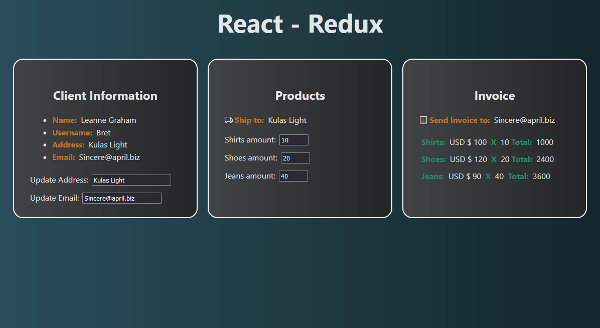

# React Redux State Handling

This is an exercise in React to practice handling states in React apps with Redux(Redux Toolkit). 

## Redux Topics:

* Store creation.
* Slices creation.
* Reducers & Actions.
* __Redux Hooks:__ useSelector, useDispatch.

## Screen Shot

